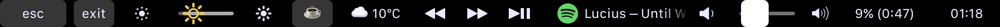

<p align="center">
    
</p>

# My TouchBar. My rules
[](https://github.com/Toxblh/MTMR/releases)
[](https://github.com/Toxblh/MTMR/blob/master/LICENSE) [](https://github.com/Toxblh/MTMR/releases/latest)  

<p align="center">
    
</p>

My the idea is to create the program like a platform for plugins for customization TouchBar. I very like BTT and a full custom TouchBar (my [BTT preset](https://github.com/Toxblh/btt-touchbar-preset)). And I want to create it. And it's my the first Swift project for MacOS :)

### Roadmap
- [x] Create the first prototype with TouchBar in Storyboard
- [x] Put in stripe menu on startup the application
- [x] Find how to simulate real buttons like brightness, volume, night shift and etc.
- [x] Time in touchbar!
- [x] First the weather plugin
- [x] Find how to open full-screen TouchBar without the cross and stripe menu
- [x] Find how to add haptic feedback
- [x] Add icon and menu in StatusBar
- [x] Hide from Dock
- [x] Status menu: "preferences", "quit"
- [x] JSON or another approch for save preset, maybe in `~/Library/Application Support/MTMR/`
- [x] Custom buttons size, actions by click
- [x] Layout: [always left, NSSliderView for center, always right]
- [ ] Overwrite default values from item types (e.g. title for brightness)
- [ ] Custom settings for paddings and margins for buttons
- [ ] XPC Service for scripts
- [ ] UI for settings
- [ ] Import config from BTT
- [ ] System for autoupdate (maybe https://sparkle-project.org/)

Settings:
- [ ] Interface for plugins and export like presets
- [ ] Startup at login
- [ ] Show on/off in Dock
- [ ] Show on/off in StatusBar
- [ ] On/off Haptic Feedback

Maybe:
- [ ] Refactoring the application on packages (AppleScript, JavaScript? and Swift?)


## Installation
- Download last [release](https://github.com/Toxblh/MTMR/releases)
- Or via Homebrew `brew cask install mtmr`

## Preset

File for customize your preset for MTMR: `open ~/Library/Application\ Support/MTMR/items.json`

## Built-in button types:

- escape
- exitTouchbar
- brightnessUp
- brightnessDown
- volumeDown
- volumeUp
- mute
- dock

> Native Plugins
- battery
- currency
- weather
- inputsource

> Media Keys
- previous
- play
- next

> AppleScript plugins
- sleep
- displaySleep

## Built-in slider types:

- brightness
- volume

### You can also make a custom buttons using these types
- `staticButton`
```json
 "type": "staticButton",
 "title": "esc",
```

- `appleScriptTitledButton`
```js
    "type": "appleScriptTitledButton",
    "refreshInterval": 60, //optional
    "source": {
      "filePath": "/Users/toxblh/Library/Application Support/MTMR/iTunes.nowPlaying.scpt",
      // or
      "inline": "tell application \"Finder\"\rmake new Finder window\rset target of front window to path to home folder as string\ractivate\rend tell",
      // or
      "base64": "StringInbase64"
    },
```

- `timeButton`
```js
  "type": "timeButton",
  "formatTemplate": "HH:mm" //optional
```

## Native plugins
- `weather`
> Provider: https://openweathermap.org Need allowance location service
```js
  "type": "weather",
  "refreshInterval": 600,
  "units": "metric", // or imperial
  "icon_type": "text" // or images
  "api_key": "" // you can get the key on openweather
```

- `currency`
> Provider: https://coinbase.com
```js
  "type": "currency",
  "refreshInterval": 600,
  "align": "right",
  "from": "BTC",
  "to": "USD",
```

## Actions:
- `hidKey`
> https://github.com/aosm/IOHIDFamily/blob/master/IOHIDSystem/IOKit/hidsystem/ev_keymap.h use only numbers
```json
 "action": "hidKey",
 "keycode": 53,
```

- `keyPress`
```json
 "action": "keyPress",
 "keycode": 1,
```

- `appleScript`
```js
 "action": "appleScript",
 "actionAppleScript": {
     "inline": "tell application \"Finder\"\rmake new Finder window\rset target of front window to path to home folder as string\ractivate\rend tell"
    // "filePath" or "base64" will work as well
 },
```

- `shellScript`
```js
 "action": "shellScript",
 "executablePath": "/usr/bin/pmset",
 "shellArguments": ["sleepnow"], // optional

```

- `openUrl`
```js
 "action": "openUrl",
 "url": "https://google.com",
```

## Additional parameters:

- `width` allow to restrict how much room a particular button will take
```json
  "width": 34
```

- `align` can stick the item to the side. default is center
```js
  "align": "left" //or "right" or "center"
```

## Example configuration:
```json
[
  { "type": "escape", "width": 110 },
  { "type": "exitTouchbar", "align": "left" },
  {
    "type": "brightnessUp",
    "align": "left",
    "width": 36
  },
  {
    "type": "staticButton",
    "align": "left",
    "title": "🔆",
    "action": "keyPress",
    "keycode": 113,
    "width": 36
  },

  {
    "type": "appleScriptTitledButton",
    "source": {
      "filePath": "/Users/toxblh/Library/Application Support/MTMR/iTunes.nowPlaying.scpt"
    },
    "refreshInterval": 1
  },
 {
    "type": "staticButton",
    "align": "left",
    "image": { "base64" : "%base64Finder%"},
    "action": "appleScript",
    "actionAppleScript": {
        "inline": "tell application \"Finder\"\rmake new Finder window\rset target of front window to path to home folder as string\ractivate\rend tell"
    },
    "width": 36
  },
  {
    "type": "appleScriptTitledButton",
    "source": {
      "inline": "if application \"Safari\" is running then\r\ttell application \"Safari\"\r\t\trepeat with t in tabs of windows\r\t\t\ttell t\r\t\t\t\tif URL starts with \"https:\/\/music.yandex.ru\" and name does not end with \"на Яндекс.Музыке\" then\r\t\t\t\t\treturn name of t as text\r\t\t\t\tend if\r\t\t\tend tell\r\t\tend repeat\r\tend tell\rend if\rreturn \"\""
    },
    "refreshInterval": 1
  },
  { "type": "previous", "width": 36, "align": "right" },
  { "type": "play", "width": 36, "align": "right" },
  { "type": "next", "width": 36, "align": "right" },
  { "type": "sleep", "width": 36 , "align": "right"},
  { "type": "displaySleep", "align": "right" },
  { "type": "weather", "refreshInterval": 1800, "width": 70, "align": "right" },
  { "type": "volumeDown", "width": 36 , "align": "right"},
  { "type": "volumeUp", "width": 36 , "align": "right"},
  { "type": "battery", "refreshInterval": 60 , "align": "right"},
  { "type": "appleScriptTitledButton", "refreshInterval": 1800, "source": { "filePath": "/Users/redetection/Library/Application Support/MTMR/Weather.scpt"} , "align": "right"},
  { "type": "timeButton", "formatTemplate": "HH:mm", "width": 64, "align": "right" }
]
```


### Author's presets

[@Toxblh preset](Resources/toxblh.json)

[@ReDetection preset](Resources/ReDetection.json)

## Credits

<a href="https://www.buymeacoffee.com/toxblh" target="_blank"></a>

Built by [@Toxblh](https://patreon.com/toxblh) and [@ReDetection](http://patreon.com/ReDetection).
