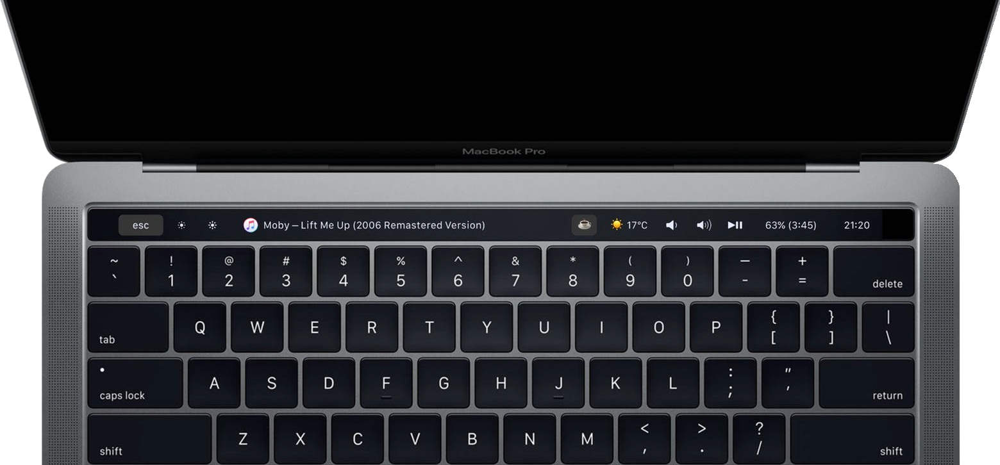

# My touchbar. My rules. [](https://github.com/Toxblh/MTMR/releases) [](https://github.com/Toxblh/MTMR/blob/master/LICENSE) 


*The TouchBar Customization App for your MacBook Pro*

My idea is to create a platform for creating plugins to customize the TouchBar. I very much like BTT and having a full custom TouchBar (my BTT preset), and I wanted to create it. It's my first Swift project for MacOS :)

**Share your presets [here](https://github.com/Toxblh/MTMR-presets)**

<p align="center">
  
</p>

[ Discord](https://discord.gg/CmNcDuQ)
[ Telegram](https://t.me/joinchat/AmVYGg8vW38c13_3MxdE_g)

<p align="center"><a href="https://www.paypal.me/toxblh/10" title="Donate via Paypal"></a>
<a href="https://www.buymeacoffee.com/toxblh" target="_blank"></a>
<a href="https://www.patreon.com/bePatron?u=9900748"></a>
<a href="https://www.producthunt.com/posts/my-touchbar-my-rules-mtmr">
    
</a></p>

## Installation
- Download lastest [release](https://github.com/Toxblh/MTMR/releases) (.dmg) from github
- Or via Homebrew `brew cask install mtmr`
- [Dario Prski](https://medium.com/@urdigitalpulse) has written a [fantastic article on medium](https://medium.com/@urdigitalpulse/customise-your-macbook-pro-touch-bar-966998e606b5) that goes into more detail on installing MTMR

**On first install** you need to allow access for MTMR in Accessibility otherwise buttons like <kbd>Esc</kbd>,  <kbd>Volume</kbd>,  <kbd>Brightness</kbd> and other system keys won't work

<p align="center">

</p>

<p align="center">
🍏→ System Preferences → Security and Privacy → tab Privacy → Accessibility → MTMR
</p>

## Examples

- [@Toxblh preset](Resources/toxblh.json)
- [@ReDetection preset](Resources/ReDetection.json)
- [@luongvo209 preset](Resources/luongvo209.json)
- [aadi_vs_anand preset](Resources/aadi_vs_anand.json)

<p align="center">
  
</p>

## Customization 

MTMR preferences are stored under `~/Library/Application\ Support/MTMR/items.json`. 

The pre-installed configuration contains more than you'll probably want, try the following instead:

```
[
  { "type": "escape", "width": 75 },
  { "type": "exitTouchbar", "align": "left", "width": 48 },
  { "type": "brightnessDown", "width": 50, "align": "left" },
  { "type": "brightnessUp", "width": 50, "align": "left" },
  {
  "type": "appleScriptTitledButton",
  "source": {
    "inline":
      "if application \"Spotify\" is running then\rtell application \"Spotify\"\rif player state is playing then\rreturn (get artist of current track) & \" – \" & (get name of current track)\relse\rreturn \"\"\rend if\rend tell\rend if\rreturn \"\"\r"
  },
  "action": "appleScript",
  "actionAppleScript": {
    "inline":
      "if application \"Spotify\" is running then\rtell application \"Spotify\"\rif player state is playing then\rnext track\rend if\rend tell\rend if\r"
  },
  "refreshInterval": 1,
  "image": {
    "base64":
      "iVBORw0KGgoAAAANSUhEUgAAAEAAAABABAMAAABYR2ztAAAABGdBTUEAALGPC/xhBQAAAAFzUkdCAK7OHOkAAAAYUExURUdwTB3WXx3UXh3VXx7XYBkXFRpVLRyURmIaeAQAAAAEdFJOUwDDO3fSqUUkAAABbklEQVRIx61VbW6DMAztoAeYNA7ApB6gkzhAWS24wIAL0HABaK6/pHFNEhy8TXu/kPzkPD/8cTj8K7KPAqB+K5NhQPCUrABCXe7HOUYYZxgVRLiG8RfY4DUgFFtC7cffAfZTFBwBdhWEKfgEq4ocEjgj4ZQifO6/QG9kkETp1dDeVWfRKx3XYSW0LoqY5kCElXDrQkyeCCuh6WL0M4nIWQIyzqixdfKU1koFDKvyCA8NJMzU4xiD+b4kfHRpsIyKc6hBwjVptFHVY51EMAINNDFGJITKDNQcdpX74Hz0CQ3rY5qwMp4EIxrlafzrsYZ2Veb0DkRgfNCUok4Y1fqEijfyi2b8RE9beWqa48Y/uvCNMcH9btfUi+/CGLR1vhL6Zz9N/vBlaCU+7lwY/cmJ67Ryen/2tj23PLqJBodZH8vgj544vOL4pxfI5acrSFxi8hrkU9TSKr78ZpnL50A8KPJJEo+afBblwyqf5j/iGys5j6ScrST2AAAAAElFTkSuQmCC"
  }
},
  { "type": "previous", "width": 50, "align": "right" },
  { "type": "play", "width": 80, "align": "right" },
  { "type": "next", "width": 50, "align": "right" },
  {
  "type": "volumeDown",
  "bordered": false,
  "align": "right",
  "width": 25,
},
{ "type": "volume", "width": 120, "align": "right"},
{
  "type": "volumeUp",
  "bordered": false,
  "align": "right",
  "width": 25
},
  { "type": "displaySleep", "width": 40, "align": "right", "bordered": false },
  {
"type": "pomodoro",
"bordered": false,
"align": "right",
"workTime": 1200, // set time work in seconds. Default 1500 (25 min)
"restTime": 600, // set time rest in seconds. Default 300 (5 min)
},
  { "type": "weather", "refreshInterval": 60, "units": "metric", "align": "right", "bordered": false, "api_key": "84645702688e83a35e2549ca77f73369"},
  { "type": "timeButton", "align": "right", "formatTemplate": "MMM d", "bordered": false  }
]
```

## Built-in button types:
> Buttons
- escape
- exitTouchbar
- brightnessUp
- brightnessDown
- illuminationUp (keyboard illumination)
- illuminationDown (keyboard illumination)
- volumeDown
- volumeUp
- mute

> Native Plugins
- battery
- currency
- weather
- inputsource
- music (tap for pause, longTap for next)
- dock (half-long click to open app, full-long click to kill app)
- nightShift
- dnd (Don't disturb)
- pomodoro
- network

> Media Keys
- previous
- play
- next

> AppleScript plugins
- sleep
- displaySleep

## Gestures on central part:
- two finger slide: change you Volume
- three finger slide: change you Brightness

## Built-in slider types:

- brightness
- volume

### You can also make custom buttons using these types
- `staticButton`
```json
 "type": "staticButton",
 "title": "esc",
```

- `appleScriptTitledButton`
```js
    "type": "appleScriptTitledButton",
    "refreshInterval": 60, //optional
    "source": {
      "filePath": "/Users/toxblh/Library/Application Support/MTMR/iTunes.nowPlaying.scpt",
      // or
      "inline": "tell application \"Finder\"\rmake new Finder window\rset target of front window to path to home folder as string\ractivate\rend tell",
      // or
      "base64": "StringInbase64"
    },
```

- `timeButton`
```js
  "type": "timeButton",
  "formatTemplate": "HH:mm" //optional
```

## Groups
```js
{
"type": "group",
"align": "center",
"bordered": true,
"title": "stats",
"items": [
    { "type": "play" }, { "type": "mute" }, ...]
}
```

To close a group, use the button:
```
{
"type": "close",
"width": 64
},
```

## Native plugins
#### `timeButton`
> Attention! Works not all: https://en.wikipedia.org/wiki/List_of_time_zone_abbreviations
```js
{
  "type": "timeButton",
  "formatTemplate": "dd HH:mm",
  "timeZone": "UTC"
}
```

#### `weather`
> Provider: https://openweathermap.org Need allowance location service
```js
  "type": "weather",
  "refreshInterval": 600, // in seconds
  "units": "metric", // or imperial
  "icon_type": "text" // or images
  "api_key": "" // you can get the key on openweather
```

#### `currency`
> Provider: https://coinbase.com
```js
  "type": "currency",
  "refreshInterval": 600, // in seconds
  "align": "right",
  "from": "BTC",
  "to": "USD",
  "full": true // £‣1.29$
```

#### `music`
```js
{
  "type": "music",
  "align": "center",
  "width": 80,
  "bordered": false,
  "refreshInterval": 2, // in seconds
},
```

#### `pomodoro`
> Pomodoro plugin. One click to start the work timer, longclick to start the rest timer. Click in progress for reset.
```js
{
  "type": "pomodoro",
  "workTime": 1200, // set time work in seconds. Default 1500 (25 min)
  "restTime": 600 // set time rest in seconds. Default 300 (5 min)
},
```

#### `network`
> Network plugin. The plugin to show usage a network
```js
{
  "type": "network",
  "flip": true
},
```

## Actions:
- `hidKey`
> https://github.com/aosm/IOHIDFamily/blob/master/IOHIDSystem/IOKit/hidsystem/ev_keymap.h use only numbers
```json
 "action": "hidKey",
 "keycode": 53,
```

- `keyPress`
```json
 "action": "keyPress",
 "keycode": 1,
```

- `appleScript`
```js
 "action": "appleScript",
 "actionAppleScript": {
     "inline": "tell application \"Finder\"\rmake new Finder window\rset target of front window to path to home folder as string\ractivate\rend tell"
    // "filePath" or "base64" will work as well
 },
```

- `shellScript`
```js
 "action": "shellScript",
 "executablePath": "/usr/bin/pmset",
 "shellArguments": ["sleepnow"], // optional

```

- `openUrl`
```js
 "action": "openUrl",
 "url": "https://google.com",
```

## LongActions
If you want to longPress for some operations, it is similar to the configuration for Actions but with additional parameters, for example:
```js
 "longAction": "hidKey",
 "longKeycode": 53,
```

- longAction
- longKeycode
- longActionAppleScript
- longExecutablePath
- longShellArguments
- longUrl

## Additional parameters:

- `width` restrict how much room a particular button will take
```json
  "width": 34
```

- `align` can stick the item to the side. default is center
```js
  "align": "left" // "left", "right" or "center"
```

- `bordered` you can do button without border
```js
  "bordered": "false" // "true" or "false"
```


### Roadmap
- [x] Create the first prototype with TouchBar in Storyboard
- [x] Put in stripe menu on startup the application
- [x] Find how to simulate real buttons like brightness, volume, night shift and etc.
- [x] Time in touchbar!
- [x] First the weather plugin
- [x] Find how to open full-screen TouchBar without the cross and stripe menu
- [x] Find how to add haptic feedback
- [x] Add icon and menu in StatusBar
- [x] Hide from Dock
- [x] Status menu: "preferences", "quit"
- [x] JSON or another approch for save preset, maybe in `~/Library/Application Support/MTMR/`
- [x] Custom buttons size, actions by click
- [x] Layout: [always left, NSSliderView for center, always right]
- [x] System for autoupdate (https://sparkle-project.org/)
- [ ] Overwrite default values from item types (e.g. title for brightness)
- [ ] Custom settings for paddings and margins for buttons
- [ ] XPC Service for scripts
- [ ] UI for settings
- [ ] Import config from BTT

Settings:
- [ ] Interface for plugins and export like presets
- [x] Startup at login
- [ ] Show on/off in Dock
- [ ] Show on/off in StatusBar
- [ ] On/off Haptic Feedback

Maybe:
- [ ] Refactoring the application into packages (AppleScript, JavaScript? and Swift?)


## Credits

Built by [@Toxblh](https://patreon.com/toxblh) and [@ReDetection](http://patreon.com/ReDetection).

[](https://github.com/igrigorik/ga-beacon)
