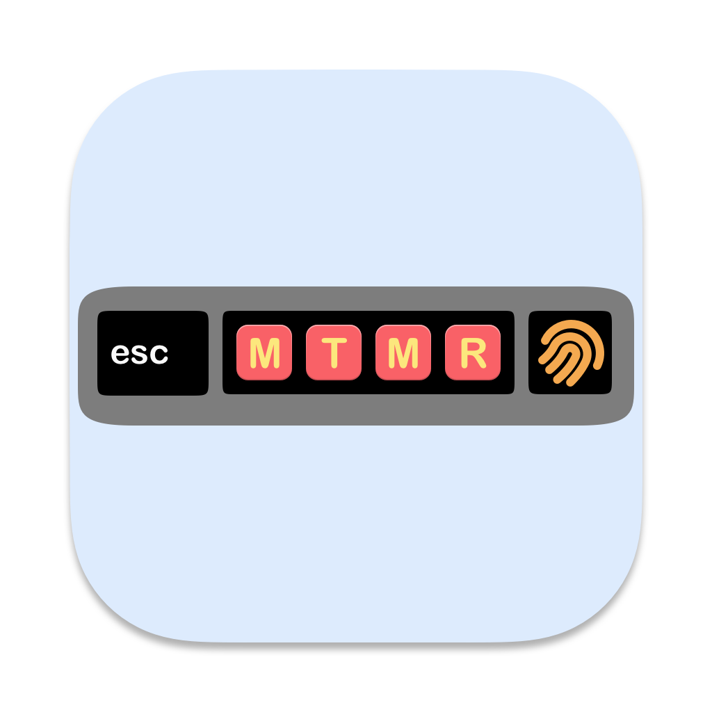

# My touchbar. My rules.

*The TouchBar Customization App for your MacBook Pro*

My idea is to create a platform for creating plugins to customize the TouchBar. I very much like BTT and having a full custom TouchBar (my BTT preset), and I wanted to create it. It's my first Swift project for MacOS :)
